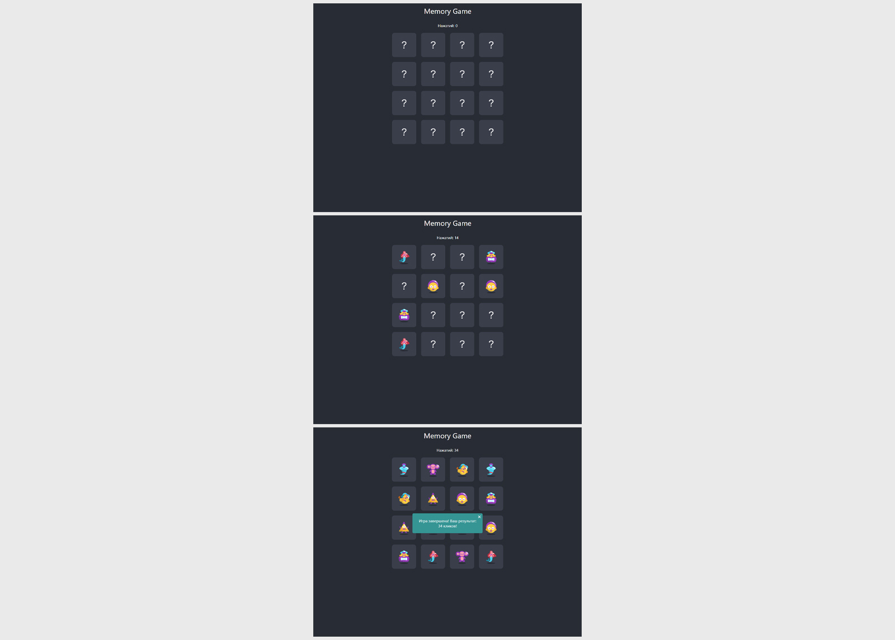

# Игра на React - "Memory Game"

Проект выполнен в рамках обучения на курсе "Профессия Frontend-Разработчик" в онлайн-школе "Айтилогия".

## Внешний вид

## Выполненные задачи:
- Знакомство с библиотекой React, её подходами к созданию SPA;
- Практика реализации игры с использованием React (классовый подход);
- Реализация логики и механики игры.

## Используемые технологии:
* React
* HTML
* CSS
* JavaScript
